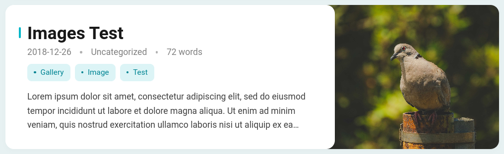

## Vivia主题使用笔记

[saicaca](https://github.com/saicaca)大神的[Vivia主题](https://saicaca.github.io/vivia-preview/index.html)深得我心，但由于[文档](https://github.com/saicaca/hexo-theme-vivia/blob/main/README.zh-CN.md)没有提及相应内容，故在此记录部分模块的使用方法。部分方法对其他Hexo主题同样适用。


### 切换主色调

打开博客目录的``_config.vivia.yml``主题配置文件，修改``hue``的数值即可。
```yml
# Appearence
hue: 270                   # The hue of the theme color (e.g. red: 0, orange: 60, blue: 260, purple: 300, pink: 345)
```

Vivia主题的[Demo](https://saicaca.github.io/vivia-preview/index.html)右下角有一个```Theme Preview```模块，你可以在其中选择喜欢的颜色，再将对应的数值替换``hue``中的值。

### 设置封面

修改``_config.vivia.yml``主题配置文件中的``Banner``模块。

```yml
# Banner
banner:
  enable: false            # Display banner
  url: /assets/banner.png
  position: center         # Specifies the alignment of the image, see the "object-position" property in CSS
  onAllPages: true         # Display banner on all pages
```

先将``enable``中的值改为``true``，再修改``url``中的路径，将其修改为你要设置的图片的路径。注意，此处的路径是相对于``/source``而言的，所以最好把封面图片放置于``source``文件夹内。 

### 设置头像与社交网站链接

修改``_config.vivia.yml``主题配置文件中的``Personal info``模块

#### 设置头像等基本信息

```yml
# Personal info
avatar: # 头像图片的路径,留空不显示头像
author: Your Name #你的名字
subtitle: This is the subtitle #名字下面的副标题
```
若要显示头像，就将头像图片的路径填写到``avatar``内。和封面一样，此处头像的路径也是相对于``/source``的。

#### 设置社交网站链接

```yml
# Personal info
avatar: 
author: Your Name
subtitle: This is the subtitle
links:
  - name: Twitter
    icon: fa-brands fa-twitter      # Find icon codes at https://fontawesome.com/search
    url: https://twitter.com
  - name: Steam
    icon: fa-brands fa-steam
    url: https://store.steampowered.com
  - name: GitHub
    icon: fa-brands fa-github
    url: https://github.com
```

将``url``内的网址替换为自己的社交网站链接即可。

若不需要某个网站，将其删除或在其前面注释

```yml
#  - name: Steam
#    icon: fa-brands fa-steam
#    url: https://store.steampowered.com
```

若要添加其他网站，将其添加于``links``内，这里以添加Bilibili为例，可以前往[这里](https://fontawesome.com/search)查找图标，并将``icon``内的第二个``fa-``后面的内容修改为你要添加的网站的图标的名称。

```yml
links:
  - name: Twitter
    icon: fa-brands fa-twitter
    url: https://twitter.com
  - name: Bilibili
    icon: fa-brands fa-bilibili
    url: #这里填写你的b站链接
```

### 设置分类、标签（其他主题也适用）

修改文章的``.md``文件开头的Front-matter区域，即文件最上方以 --- 分隔的区域。

```yml
---
title: My post
date: 2023-09-16 11:45:14 
---
```
新增``categories: ``、``tags:``，并在里面分别输入想要的分类和标签名称，如

```yml
---
title: My post
date: 2023-09-16 11:45:14 
categories: post
tags: test
---
```

[参阅Hexo关于Front-matter的文档](https://hexo.io/zh-cn/docs/front-matter)

[多标签写法](https://zhuanlan.zhihu.com/p/348131730)

此外，我们还可以修改``/scaffolds/post.md``文件，在其中添加``tag: ``与``categories: ``，以后新建文章的时候就不用自己手动输入了
```yml
---
title: {{ title }}
date: {{ date }}
categories: 
tags: 
---
```

### 设置文章的预览图片

修改文章的``.md``文件开头的Front-matter区域，新增``photos: ``，并输入封面图片的路径，具体如下：

```yml
---
title: My post
date: 2023-09-16 11:45:14 
categories: post
tags: test
photos: covers/example.png
---
```

注意，此处要填写的路径是相对于``/source/``的，若要以``/source/covers/example.png``作为封面图，``photos``应该填写为``covers/example.png``。

[参考](https://github.com/saicaca/hexo-theme-vivia/issues/8)

参考效果：


## Hexo使用笔记

*施工中……*