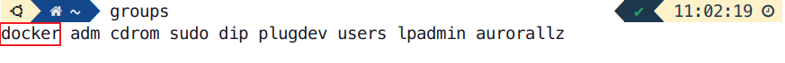
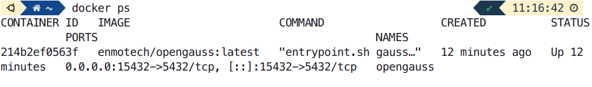
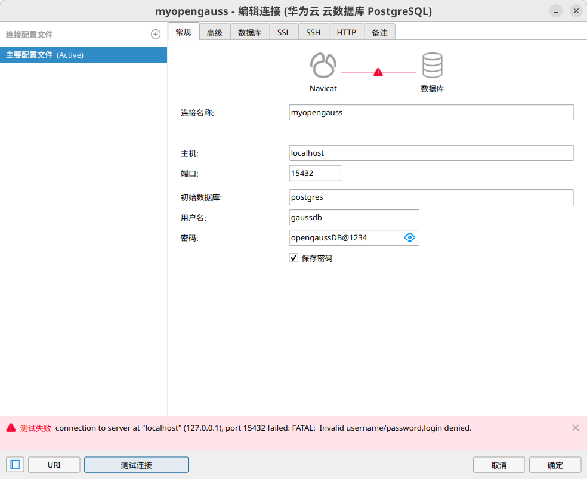
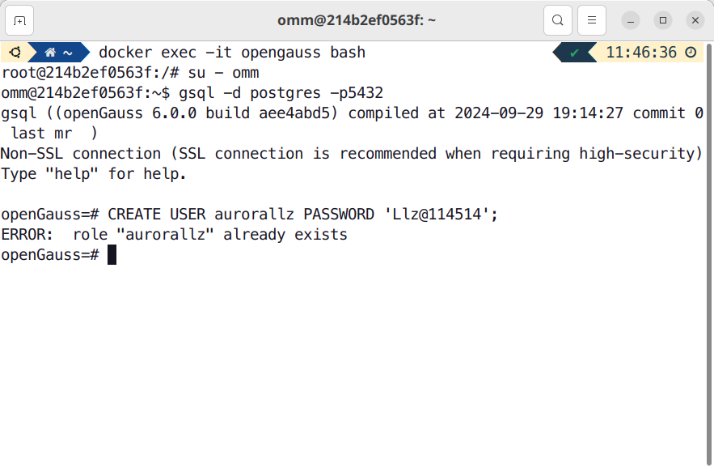
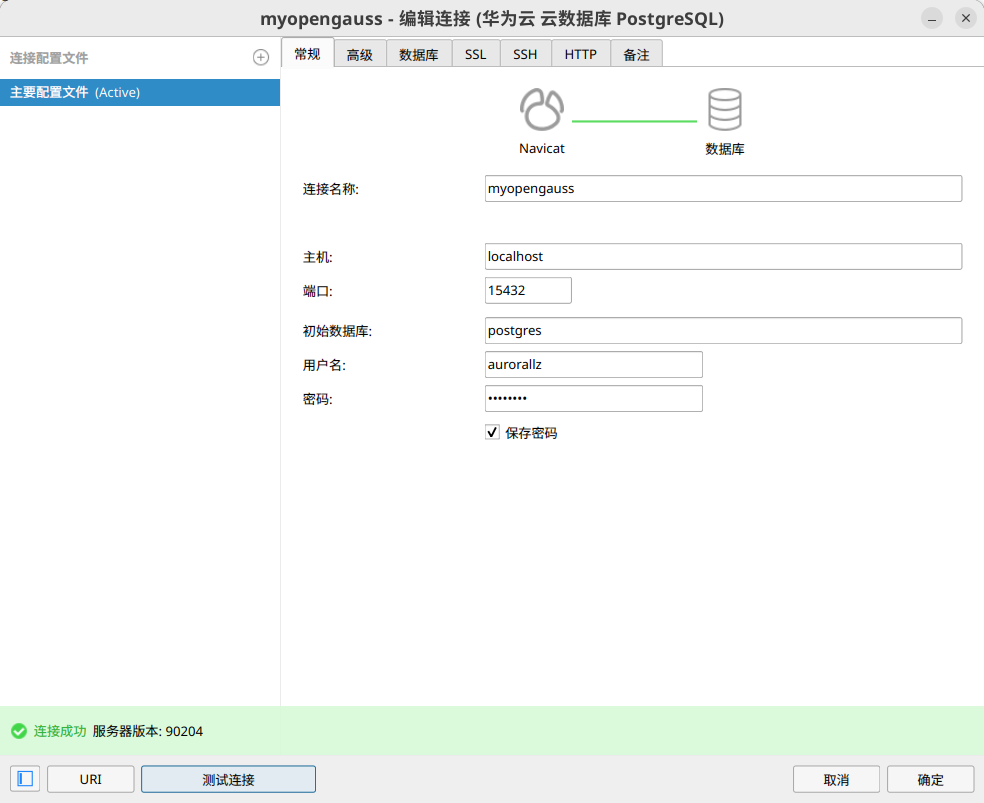
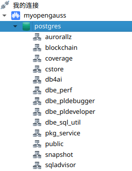

本学期的数据库系统原理课程需要使用Docker配置OpenGauss，按照老师发布的Windows版教程实践下来发现了一些问题，于是便诞生了本文。

> **运行环境**
> 操作系统：Ubuntu 24.04.2 LTS x86_64
> 内核版本：Linux 6.11.0-19-generic
> Shell：zsh 5.9
> Docker版本：28.0.1 build 068a01e
> Navicat版本：Navicat Premium Lite 17.2.1

## 安装与配置Docker

如果你已经安装Docker并且配置完毕，请跳过此段。Ubuntu用户可参考[这里](https://docs.docker.com/engine/install/ubuntu/)，使用apt存储库安装Docker。

### 配置镜像源加速

不过在运行`hello-world`镜像来验证安装是否成功的时候，你大概率会看到这样的报错：

```shell
Unable to find image 'hello-world:latest' locally
docker: Error response from daemon: Get "https://registry-1.docker.io/v2/": net/http: request canceled while waiting for connection (Client.Timeout exceeded while awaiting headers)

Run 'docker run --help' for more information
```

这是因为国内从DockerHub拉取镜像较为困难，我们需要配置国内可用的镜像源：

1. 编辑Docker配置文件`/etc/docker/daemon.json`

   如果本地没有配置文件，可按照下面的方法进行创建：

   ```shell
   sudo mkdir -p /etc/docker
   sudo tee /etc/docker/daemon.json <<-'EOF'
   {
     "registry-mirrors": [
       "https://docker.mirrors.ustc.edu.cn",
       "http://hub-mirror.c.163.com",
       "https://docker.1ms.run",
       "https://docker.xuanyuan.me",
       "https://docker.1panel.live"
     ]
   }
   EOF
   ```

2. 重新加载并重启Docker服务：

   ```shell
   sudo systemctl daemon-reload
   sudo systemctl restart docker
   ```

3. 再次拉取 `Hello-world`镜像，可以成功安装：

   ```shell
   sudo docker pull hello-world
   ```

若使用Docker Desktop，可参照[此教程](https://www.cnblogs.com/Flat-White/p/17107494.html)配置镜像源。

### 配置用户组（可选）

我们发现，每次执行`docker`命令都需要加上`sudo`，有些繁琐。我们可以将用户添加到Docker用户组，我们就无需`sudo`即可执行`docker`命令：

1. 在系统中创建`docker`用户组：

   ```shell
   sudo groupadd docker
   ```

2. 将用户添加到`docker`用户组：

   ```shell
   sudo usermod -aG docker $USER
   ```

3. 更新用户组：

   ```shell
   newgrp docker
   ```

4. 查看是否添加成功：

   ```shell
   groups
   ```

   出现`docker`即表明添加成功：

   

## 通过Docker安装OpenGauss

### 配置OpenGauss容器

1. 拉取OpenGauss镜像：

   ```shell
   docker pull enmotech/opengauss:latest
   ```

2. 创建OpenGauss容器：

   ```shell
   docker run --name opengauss --privileged=true -d -e GS_PASSWORD=opengaussDB@1234 -v /home/{username}/db/opengaussdata:/var/lib/opengauss -p 15432:5432 enmotech/opengauss:latest
   ```

   `GS_PASSWORD`参数设置了OpenGauss数据库超级用户`omm`以及测试用户`gaussdb`的密码。密码有复杂度要求，**长度密码要求8个字符及以上，必须同时包含英文字母大小写、数字、以及特殊符号**。`opengaussDB@1234`为我自己设置的密码，你可以根据规则自行修改；

   `-v /home/user/db/opengaussdata:/var/lib/opengauss`表示将容器内的`/var/lib/opengauss`路径映射到本机的`/home/{username}/db/opengaussdata`路径上，可以自行设置对应路径；

   `-p 15432:5432`表示将容器内的`5432`端口映射到`15432`端口，供本机使用。

   配置完成后，容器会自动运行

3. 启动容器

   查看容器是否正常运行：

   ```shell
   docker ps
   ```

   出现下图表示容器已经正常运行

   

   若找不到容器，可以执行下面的命令重启容器，`{xxx}`表示容器ID的前三位，如上图的容器ID前三位为`214`

   ```shell
   docker restart {xxx}
   ```

   如果忘记容器ID，可以通过下面的命令列出所有的容器：

   ```shell
   docker ps -a
   ```

### 配置用户

在我的实践过程中，本地无法通过测试用户`gaussdb`和刚才配置的密码进行连接数据库，提示密码与用户名无效：



我们需要进入容器中自行配置用户

1. 执行下面命令进入容器：

   ```shell
   docker exec -it opengauss bash
   ```

2. 进入容器中的omm超级用户，通过`gsql`访问数据库，`5432`为容器内部端口。

   ```
   su - omm
   gsql -d postgres -p5432
   ```

3. 创建用户，下面的用户名和密码可自行修改：

   ```SQL
   CREATE USER aurorallz PASSWORD 'Llz@114514';
   ```

   因为我已经创建过一次，此处提示用户已存在。



### 通过Navicat连接数据库

启动Navicat，连接名称自取，端口为先前设置的`15432`，用户名和密码即为我们上一节中在容器内设置的。连接成功！



## 无法通过测试用户gaussdb进行连接的猜测

[这篇文章](https://bbs.huaweicloud.com/blogs/324074)中提到，测试用户`gaussdb`是在[`entrypoint.sh`](https://github.com/enmotech/enmotech-docker-opengauss/blob/master/1.0.1/entrypoint.sh)中自定义创建的用户，猜测是`entrypoint.sh`脚本未能正常执行，导致测试用户`gaussdb`未能正确建立，因此无法通过测试用户`gaussdb`进行连接。如果你对此有想法，欢迎到评论区讨论～



## 参考资料

[在Docker中快速体验openGauss数据库——小麦苗DB宝](https://bbs.huaweicloud.com/blogs/324074)

[Unbuntu22.04 使用 Docker 安装 OpenGauss——Tiancy](https://blog.tiancy.cn/2024/03/05/opengauss-docker-build/)

[通过Docker安装openGauss（Windows篇）——Sinkhorn](https://www.bilibili.com/opus/1045677588614217733)

[How to Fix Docker Permission Denied?——Marko Aleksic](https://phoenixnap.com/kb/docker-permission-denied)

[【Docker】设置镜像加速器：修改/etc/docker/daemon.json——彬彬侠](https://blog.csdn.net/u013172930/article/details/146019109)
