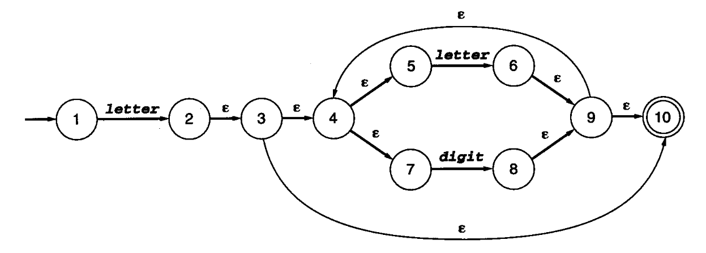
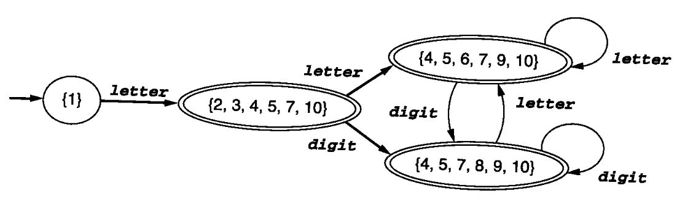
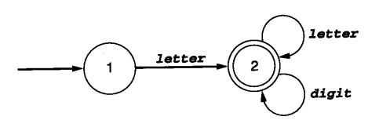
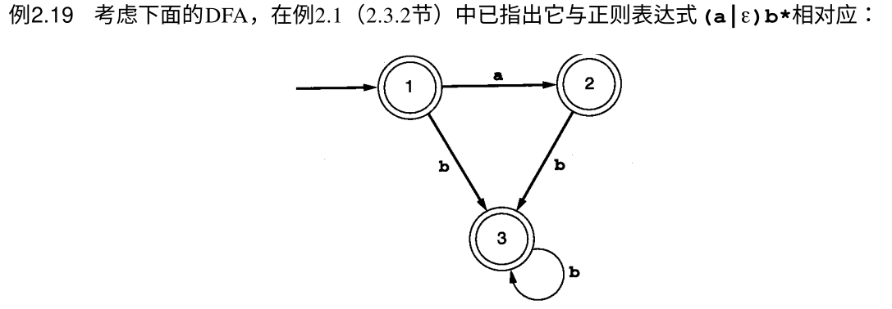
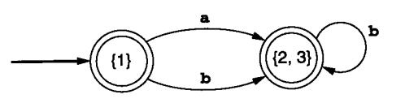
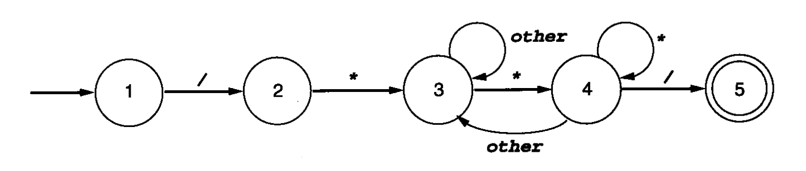

> 要求：会写正则表达式、画NFA、画DFA
>
> 熟悉实验二的流程：词法分析程序`getToken()`、正则表达式转NFA、NFA转DFA、DFA最小化、DFA生成词法分析程序
>

简单一点的：手工方法画图

难的会写代码，以及各个流程的具体代码（需要明确具体的各个流程之间的转换代码）：

- 定义数据结构

- getToken解析源代码

- 高级正则转基本正则：如`a+`->`aa*`、`a?`->`(a|#)`

- 再对基本正则转NFA

- NFA转DFA

- DFA最小化

- 根据最小化DFA写出词法分析代码

## NFA转DFA

  1. **求Epsilon闭包**：求A状态的Epsilon，就是求从A出发，可以通过Epsilon转换到达的所有状态

  2. **消除多重转换**：子集构造法
  3. 例子

   

  - 先求始态1的Epsilon闭包：`{1}`（1没有到其他状态的epsilon转移）

  - 然后看图，发现除了epsilon转移，还有`letter`与`digit`转移，画出表格框架：

    | 状态集合 | letter | digit |
    | :------: | :----: | :---: |
    |   {1}    |        |       |

  - 接下来，进行子集构造：分别寻找`{1}`通过`letter`与`digit`转移可以到达的状态集合（包括借助epsilon转移可以到达的状态，在一轮寻找中，`letter`与`digit`只能借助一次）：

    1. 寻找通过`letter`转移可以到达的状态集合：`{2, 3, 4, 5, 7, 10}` （为什么没有6？因为只能借助一次`letter`），然后将找到的状态集合填表

       |      状态集合       |       letter        | digit |
       | :-----------------: | :-----------------: | :---: |
       |         {1}         | {2, 3, 4, 5, 7, 10} |       |
       | {2, 3, 4, 5, 7, 10} |                     |       |

    2. 寻找通过`digit`转移可以到达的状态：无，不填

  - 我们接着对新状态集合`{2, 3, 4, 5, 7, 10}`进行相似的搜寻，分别找到通过`letter`转移可以到达的状态集合`{6, 9, 10, 4, 5, 7}`，以及通过`digit`转移可以到达的状态集合`{8, 9, 10, 4, 5, 7}`，之后更新表格

    |      状态集合       |       letter        |        digit        |
    | :-----------------: | :-----------------: | :-----------------: |
    |         {1}         | {2, 3, 4, 5, 7, 10} |                     |
    | {2, 3, 4, 5, 7, 10} | {6, 9, 10, 4, 5, 7} | {8, 9, 10, 4, 5, 7} |
    | {6, 9, 10, 4, 5, 7} |                     |                     |

  - 接下来再对`{6, 9, 10, 4, 5, 7}`与`{8, 9, 10, 4, 5, 7}`分别求解，得出结果并更新表格……一直求解，直到不再产生新的状态或转移。最终表格如下：

    |    状态集合\符号    |       letter        |        digit        |
    | :-----------------: | :-----------------: | :-----------------: |
    |         {1}         | {2, 3, 4, 5, 7, 10} |                     |
    | {2, 3, 4, 5, 7, 10} | {6, 9, 10, 4, 5, 7} | {8, 9, 10, 4, 5, 7} |
    | {6, 9, 10, 4, 5, 7} | {6, 9, 10, 4, 5, 7} | {8, 9, 10, 4, 5, 7} |
    | {8, 9, 10, 4, 5, 7} | {6, 9, 10, 4, 5, 7} | {8, 9, 10, 4, 5, 7} |

  - 完成后，即可根据表格画出DFA图（记得给NFA接受状态`10`所在的的状态集合画上双圈，表示DFA的接受状态）：

     

## DFA最小化

  1. 将原始DFA分为**接受状态集合**`S1`与**非接受状态集合**`S2`两个集合
  2. 对`S1`与`S2`里面每个状态，分别判断它们通过所有的符号转移后，得到的状态集合是否一致？如果一致，说明它们同属一个集合（可以最小化为一个状态）；如果不一致，则划分出去成为新的集合
  3. 例子1：

  对上面的DFA，令

  `A = {1}`，`B = {2, 3, 4, 5, 7, 10}`，`C = {6, 9, 10, 4, 5, 7}`，`D = {8, 9, 10, 4, 5, 7}`;

  |      状态集合\符号      |         letter          |          digit          |
  | :---------------------: | :---------------------: | :---------------------: |
  |         A = {1}         | B = {2, 3, 4, 5, 7, 10} |                         |
  | B ={2, 3, 4, 5, 7, 10}  | C = {6, 9, 10, 4, 5, 7} | D = {8, 9, 10, 4, 5, 7} |
  | C = {6, 9, 10, 4, 5, 7} | C = {6, 9, 10, 4, 5, 7} | D = {8, 9, 10, 4, 5, 7} |
  | D = {8, 9, 10, 4, 5, 7} | C = {6, 9, 10, 4, 5, 7} | D = {8, 9, 10, 4, 5, 7} |

  现在根据**是否为接受状态**来划分出两个集合：`S1 = {A}`、`S2 = {B, C, D}`;

  我们观察上面的表格，发现对于`S1`内部的状态`A`，通过`letter`转移到`S2`的`B`；而对于`S2`内部的三个状态，它们都是通过`letter`转移到`S2`的`C`和通过`digit`转移到`S2`的`D`，说明它们三个确实属于`S2`集合，`S2`集合无需再进一步划分，可以融合为一个状态。

  最终，我们根据`S1`与`S2`得到最小化DFA：

   

  4. 例子2：

   

   来看这个DFA，它们都是接受状态，因此我们先划分一个集合`S1 = {1, 2, 3}`

  然后依次看里面的三个状态：

  - 状态`1`可以通过`a`到达状态`2`、通过`b`到达状态`3`
  - 状态`2`可以通过`b`到达状态`3`
  - 状态`3`也可以通过`b`到达状态`3`

  我们发现，状态`1`和状态`2`、状态`3`不一样，因此`S1`分裂为`{1}`与`{2, 3}`两个集合

  最终得到最小化DFA：

   


## 最小化DFA转词法分析程序

 

```cpp
int state = 1;
char ch = nextChar();

while (true) {
    switch (state) {
    case 1:
        if (isLetter(ch)) {
            ch = nextChar(); // 接收下一字符
            state = 2; // 进入下一状态
        } else {
            error();   // 出错
            return;
        }
        break;
    case 2:
    	if (isLetter(ch) || isDigit(ch)) {
            ch = nextChar(); // 接收下一字符
        } else {
            accept();  // 接受状态
            return;
        }
        break;
    default:
        error();
        return;
    }
}
```

 

```cpp
int state = 1;
char ch;

while (true) {
    switch (state) {
        case 1:
            if (ch == '/') {
                ch = nextChar();
                state = 2;
            } else {
                error();
            }
            break;
        case 2:
            if (ch == '*') {
                ch = nextChar();
                state = 3;
            } else {
                error();
            }
            break;
        case 3:
            if (ch == '*') {
                ch = nextChar();
                state = 4;
            } else { // other
                ch = nextChar(); // 接收其他字符，停留在状态3
            }
            break;
        case 4:
            if (ch == '/') {
                ch = nextChar();
                state = 5;
            } else if (ch == '*') {
                ch = nextChar(); // 接收*，停留在状态4
            } else { // other
                ch = nextChar();
                state = 3; // 接收其他字符，回到状态3
            }
            break;
        case 5:
            accept(); // 结束
            return;
        default:
            error();
            return;
    }
}
```
