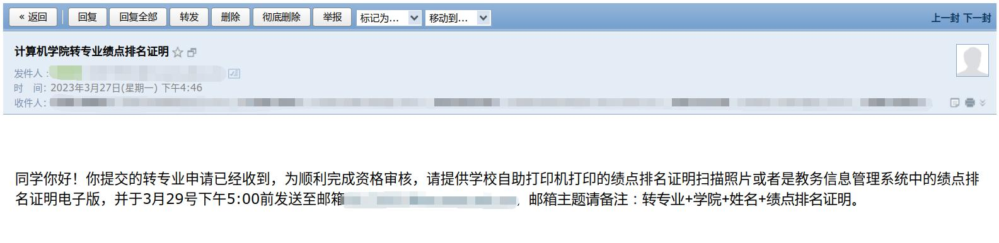
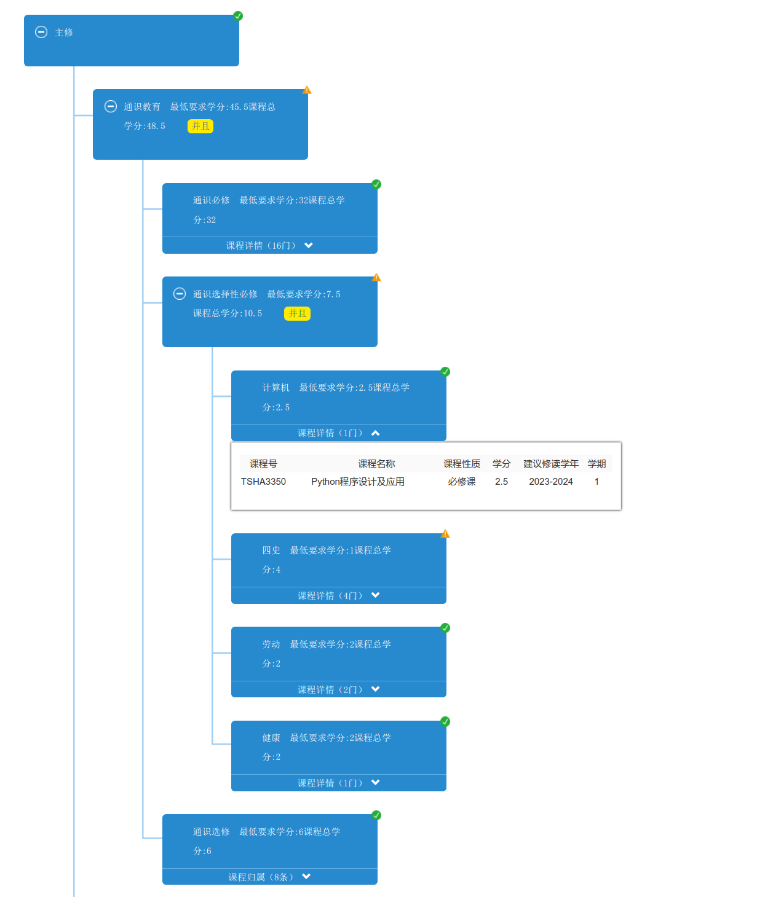
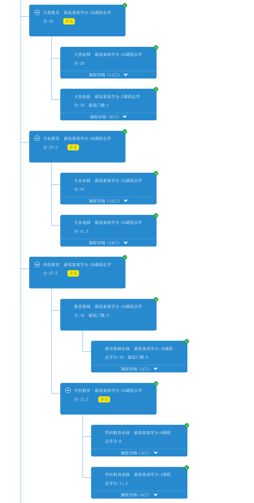
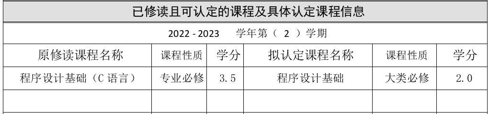
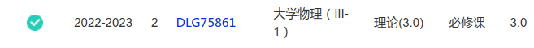
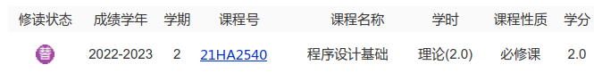

## 前言

在转专业的途中，能找到的公开信息寥寥无几，受[苏州大学转专业通用指南](https://gaoge011022.gitbook.io/suda-major-change-guide-universal/)的启发，作为一名转专业的学生，我也希望将自己转专业的全过程记录下来。如果能帮到你，或者给到你一些启发，我会非常开心。

<!--more-->

本文适用于华南师范大学打算转专业、或正准备转专业进入**计算机学院**的同学参阅。想要转入其他专业的同学，或其他学校的同学也可参考。

*时效性注意：本文写于2023年9月，所参考的资料发布日期不晚于2023年9月，请同学以你们当年发布的通知为准。*

标题中带有*的仅适合想要转入计算机学院的同学参阅。 

## 时间节点

### 通知发布

每年春季学期（第二学期）开学后一到两周，学校就会发布[转专业通知](https://mp.weixin.qq.com/s/CXgcMbDL8XDNv_VMO08uSg)。请关注**晚安华师**微信公众号与 **[教务系统](https://jwxt.scnu.edu.cn/)**，以便尽早获取转专业的相关通知。这份转专业通知会包含今年的转入要求以及考核内容，但**最好不要看到通知才开始准备**。可以前往想要转入学院的[官网](https://www.scnu.edu.cn/a/20151026/29.html)参考往年的转专业要求，通常情况下一两年内的要求变化不会很大。~~但是计算机学院今年的变化就蛮大~~。

### 报名申请

申请转专业的时间一般在**三月份中上旬**，但具体日期每年都不同。

你需要到[教务系统](https://jwxt.scnu.edu.cn/xszzy/xszzysqgl_cxXszzysqIndex.html?doType=details&gnmkdm=N106204&layout=default)进行转专业申请，填写报名表后，将它打印并保存。

在这期间，你可能会收到一封来自学院教务老师的邮件，要求你提交专业绩点排名证明或其他材料。



<center>（收到的邮件的截图）</center>

下载专业绩点排名证明，前往华师[综合服务平台](https://sso.scnu.edu.cn/)内的[电子成绩单/证明服务平台](https://certificate.scnu.edu.cn/ec/user/)，依次选择“电子证明”、“(本科)绩点排名证明”、“下载PDF”、“申请记录”，找到刚才申请的绩点排名证明，选择“下载到本地”，即可下载绩点排名证明的电子版，将它按照老师要求的格式命名，再发回给老师。电子成绩单、学籍异动证明等其他材料也可以在这里下载，下载方法类似。

随后就等待学院发布正式考核的通知。

### 正式考核

不同学院的正式考核日期**并非全校统一**，以各个学院公布的为准。报名转专业后要多多关注**转入学院的官网**，并留意自己报名时所填写的**邮箱等联系方式**（部分学院不会在官网公布考核信息，而是通过邮箱等联系方式进行通知）。

按照往年惯例，计算机学院会在官网发布正式考核通知。学院的官网请参阅：

- [计算机学院的官网](http://cs.scnu.edu.cn/)

- [地理科学学院官网](http://geography.scnu.edu.cn/)

- [其他学院官网导航](https://www.scnu.edu.cn/a/20151026/29.html)

部分学院会要求你扫码加入转专业通知群，请务必加入其中。

## 如何选择（平级转or降级转）

选择平级转专业或降级转专业都各有利弊。在此给出我当时的分析，供你参考。我认为无论是平级转还是降级转，基于认真考虑，选择最适合自己的，就是最好的选择。

**需要注意的是**，并非所有学院都支持外院的同学平级转专业。如地理科学学院、心理学院等学院要求非本院的学生必须降级转专业；部分学院的特定专业暂时不接受从其他专业转入，如数学科学学院的应用数学（师范）专业。更多细节请参考[转专业附件资料](https://pan.baidu.com/share/init?surl=qXbqX3hPDM7T-MN6UK19pg&pwd=2023)中的附件1。

*时效性注意：本附件是2023年的转专业附件资料，请同学以你们当年发布的资料为准。*

### 平级转专业

选择平级转可以利用剩下三年修完四年的课程，比降级转的同学更早毕业

选择平级转的名额更多（今年计算机学院平转名额有10个，降转只有8个）

选择平级转需要补修大一一年的课程，如果你的专业跨度很大，可能会比较痛苦

选择平级转需要扎实的基础，以应对大二上学期的“硬课”

绩点排名的问题

……

### 降级转专业

选择降级转需要多读一年，相当于“重开”大学生活，相比大一新生更有经验

选择降级转有更多时间打牢专业基础，有更多的时间探索喜欢的事情

选择降级转，原来的同学比你更早毕业，可能会有心理压力

选择降级转，不好好利用，可能会浪费这多出来的一年

……

### 纠结？*

*注：本条仅适用于转入计算机学院的同学*

如果你还有点纠结，或者想听从命运的安排，我觉得可以先通过自学打牢基础，然后优先选择平级转。

如果当年选择降级转专业的人数未满，并且选择平级转专业的同学数量超出录取名额，原本选择平级转的同学可能有降转的机会，即调剂。

至于当年是否会调剂，请在报名时咨询转入学院的老师。

## 考核要求*

**注**：*此部分仅适合想要**转入计算机学院**的同学参阅。*

*时效性注意：本部分是2023年转入计算机学院的考核要求，仅供参考。请同学以你们当年发布的要求为准。*

今年（2023）计算机学院的考核包括**笔试、实验和面试**三项。

无论是平级还是降级转，都要参加这三项考核，区别是笔试所考核的内容不同。

**时间**：2023年4月6日（周四）下午

**地点**：[石牌校区计算机学院](https://ditu.amap.com/search?id=B0FFH2382Q&city=440106&geoobj=114.573315%7C38.725691%7C119.995068%7C41.147114&query_type=IDQ&query=%E5%8D%8E%E5%8D%97%E5%B8%88%E8%8C%83%E5%A4%A7%E5%AD%A6%E8%AE%A1%E7%AE%97%E6%9C%BA%E5%AD%A6%E9%99%A2(%E4%B8%9C%E9%97%A8))530实验室

**[考核内容](http://cs.scnu.edu.cn/a/20230329/5418.html)**：

对申请转入2022级（**平级转**）的学生，需考核离散数学和程序设计的基础知识。

> - **离散数学**, 主要考察**数理逻辑、集合论**的基础知识（仅在笔试考查）
> - **C语言程序设计**
> - **计算机基础知识**

对申请转入2023级（**降级转**）的学生，主要考察学生**程序设计的基础知识**，即除离散数学外，其他与平级转的学生一致。

>学院规定的参考书目 [①、② ③二选一]：
&nbsp;&nbsp;&nbsp;&nbsp;① 屈婉玲等编著.《离散数学(第2版)》, 高等教育出版社.
&nbsp;&nbsp;&nbsp;&nbsp;② 李含光,郑关胜编著.《C语言程序设计教程》, 清华大学出版社.
&nbsp;&nbsp;&nbsp;&nbsp;③ 翁慧玉,俞勇编著.《C++程序设计——思想与方法》幕课版(第3版), 人民邮电出版社.


## 试题回忆*

**注**：*此部分仅适合想要**转入计算机学院**的同学参阅。*

由于我选择降级转专业，因此笔试只有C语言相关的内容，不包含离散数学。

试题为回忆版本，与实际有一些小差异，而且试题每年都会变化，**仅供参考**。

### 笔试（占比30%）

**时间**：13:00 - 13:50（~~午休时间困的很~~）

**形式**：50道单选题，50分钟完成

**考察内容大致有**：

- 数据类型
- 存储类别（``static``等）
- 运算符
- 程序控制结构（顺序、选择、循环）
- 递归
- 函数
- 作用域
- **数组**（包含字符串）
- **指针**
- 结构体
- 文件读写操作

等等，几乎涵盖一门C语言程序设计基础课的所有内容，建议**尽早做准备**！

~~本来以为不会考指针的，失策了~~

最后记得将答案填写到第一页的答案框上！

2023年10月16日补充：通过向平级转专业的同学打听得知离散数学不仅考查**数理逻辑、集合论**的相关知识，还超纲考查了**图论**等内容（但占比不多，毕竟考核要求中写明**主要**考察数理逻辑、集合论的基础知识），学有余力的同学建议学习更多的离散数学知识，不要拘泥于考核要求。在此感谢提供信息的同学。

### 实验（占比30%）

**时间**：14:05 - 14:55

**形式**：上机编写代码，最后copy到一个Word文档并提交 ~~（我还以为会是OJ的形式）~~

机房电脑的操作系统是Windows 10，有VS Code（英文，没有配置C/C++环境，只能作为纯粹的编辑器）、Visual Studio 2010/2015/2022（可以跑代码与debug，但可能需要登陆）、DevC++（英文，可以正常跑代码,似乎不能debug）~~、VC++ 6.0、Code::Blocks~~等编辑器或IDE供你操作，可惜没有MinGW。

**试题与题解**

T1. 输入分数，（输入-1退出），统计考试人数、平均分、最高分、最低分。（40分）

```c
#include<stdio.h>

double aver(double mark[], int num);
double high(double mark[], int num);
double lowe(double mark[], int num);

int main(void) {
    double mark[256] = {0};
    int num = 0;
    //输入分数，记录于数组中
    for (int i = 0; i < 256; i++) {
        scanf("%lf", &mark[i]);
        if (mark[i] == -1) { //输入-1时退出
            num = i;
            break;
        }
    }
    printf("考试人数：%d\n", num); //输出考试人数
    printf("平均分：%lf\n", aver(mark, num)); //输出平均分
    printf("最高分：%lf\n", high(mark, num)); //输出最高分
    printf("最低分：%lf\n", lowe(mark, num)); //输出最低分
    return 0;
}
//平均分
double aver(double mark[], int num) {
    double sum;
    for (int i = 0; i < num; i++) {
        sum += mark[i];
    }
    return sum / num;
}
//最高分
double high(double mark[], int num) {
    double max = mark[0];
    for (int i = 0; i < num; i++) {
        if (mark[i] > max) {
            max = mark[i];
        }
    }
    return max;
}
//最低分,改写high()即可
double lowe(double mark[], int num) {
    double min = mark[0];
    for (int i = 0; i < num; i++) {
        if (mark[i] < min) {
            min = mark[i];
        }
    }
    return min;
}
```

T2. 定义一个函数``func()``。输入一个数字,判断数组内有没有这个数。如果有,输出其第一个位置,并统计这个数出现的次数。若找不到,输出“找不到”。（40分）

代码片段如下，正式考核需补全主函数部分：

```c
void func(int a[], int length, int n) {
    int count = 0;
    int firstIndex = -1;
    //查找数字,统计
    for (int i = 0; i < length; i++) {
        if (a[i] == n) {
            if (firstIndex == -1) {
                firstIndex = i;
            }
            count++;
        }
    }
    //输出
    if (firstIndex == -1) {
        printf("找不到\n");
    } else {
        printf("第一个%d的下标: %d\n", n, firstIndex);
        printf("共有%d个%d\n", count, n);
    }
}
```

T3. 考察排序算法。任给一个数组，从小到大排序后输出结果。(20分)

代码片段如下，正式考核需补全主函数部分：

```c
void selectionSort(int a[],int length) {
    int temp = 0;
    for (int i = 0; i < length - 1; i++) {
        int index = i; // 记录最小元素的索引
        // 寻找未排序部分中的最小元素的索引
        for (int j = i + 1; j < length; j++) {
            if (a[j] < a[index]) {
                index = j;
            }
        }
        // 将最小元素与当前位置的元素交换
        temp = a[i];
        a[i] = a[index];
        a[index] = temp;
    }
}
```

### 面试（占比40%）

**时间**：15:15开始

**流程**：

- 首先自我介绍，你的个人基本情况，以及转专业的原因？

- 然后问你为转专业做了什么准备，付出了哪些努力？

- 最后问愿不愿意调剂到其他专业？（因为今年第一轮报名中有些专业没人报名）

总之，要让老师看到你**诚恳的态度**以及**为之付出的努力**，面试这一关对于降转的同学并不算很难

**经验参考**：[大学转专业面试，需要怎么准备？](https://www.zhihu.com/question/268564002/answer/1362933883)

### 一些小建议

- **绩点非常重要！** 即使你不喜欢原来的专业课，也要努力稳住第一个学期的绩点！**更不要挂科！**
    计算机学院从今年（2023年）就开始对平级转专业和降级转专业的同学“一视同仁”，都要求绩点在**原专业前20%** 才有机会转入。（往年只对平级转专业有要求）

- 编程的学习需要亲自**动手实践**，千万不能只看不做

- 尽早配置好趁手的编程环境

- 不管如何，确定了转专业的目标就要**早做准备**，越早开始学习，就可以学的更多、更深入，你也会更有信心取得成功

### 学习资源推荐

哈佛大学的[CS50](https://cs50.harvard.edu/college/2021/spring/)，也是我的CS启蒙课，虽然是英文，但认真听你一定会有收获。学到Week5 Data Structures以后就几乎涵盖了转专业的考核内容了（[b站机翻视频链接](https://www.bilibili.com/video/BV18K4y1N74x/)）；

浙大的[程序设计入门——C语言](https://www.icourse163.org/course/ZJU-199001?tid=1206100273)，听完后，自己动手将代码实现一遍；

[Crash Course Computer Science](https://www.bilibili.com/video/BV1EW411u7th/)，了解计算机的基础知识； ~~（虽然今年没考）~~

[How to Think Like a Computer Scientist: C Version](https://github.com/tscheffl/ThinkC/releases/download/v1.10/Think-C.pdf)，一本深入浅出的C语言介绍书，值得一看；

K. N. King的[C语言程序设计：现代方法](https://book.douban.com/subject/35503091/)，涵盖C语言基础内容，并进行深度的拓展。

## 转专业成功后

恭喜你转专业成功！不过，剩下的大半个学期你还是要留在原专业修完原来的课程，并参加期末考。

在此期间，你可以更深入地了解转入学院与转入专业，为下学期在新专业的学习提前做准备。

转入计算机学院的同学可以学习更多有关计算机的知识，比如继续完成[CS50](https://cs50.harvard.edu/college/2021/spring/)的HW与Project、开始学习[CS61A](https://cs61a.org/)、探索你喜欢的方向等等……在此介绍一份[CS自学指南](https://csdiy.wiki/)。

### 预习新课程

能够成功转专业的同学学习能力都不会太差，但因为之前不一定修读过新专业的课程，因此在转专业后可能会不适应新课程，尤其是大跨度平级转专业的同学。

建议你利用好空余时间，及时补上一些落下课程的知识。可以在转专业成功后就着手开始学习尚未修读的专业课，并预习新课程。转专业后的那个暑假是空余时间是最多的，还需充分利用。

### 选课

原则上转专业成功后的这个学期还是可以选公共课的，包括思政课、体育课、外语课和公选课。如果在同校区转专业，遇到喜欢的老师建议先选上。到了新学期开学第一周，即第三轮选课的时候，如果课程实在是冲突的话再退课也不晚。

对于平级且在院内转专业的同学，思政课、体育课、外语课和公选课完全可以先选。因为这些课程的开课单位给每个学院所开课程的时间是固定的，你在院内转专业就不用担心时间冲突的问题。在第一轮就先选课还有概率选上心仪的老师，等到第三轮选课的时候就只能捡漏了。

对于降级且在同校区转专业的同学，大二上学期的一些课程也可以先选上。因为不少专业到了大二的课会更多，但是转专业后的大一是几乎没有公共课的，如果可以在大一上学期就修完部分大二上学期的课，可以降低大二上学期的课程压力。

以上的选课建议是我转专业一年后所提出的，由于信息差，我自己并没有提前选课。希望可以给到同校区转专业的同学多一些选择上的参考。

### 适应新环境

#### 添加新专业的辅导员、同学

如果你是平级转专业的同学，建议添加新转入专业的辅导员老师，以及联系新班级的级委、班委等同学，及时融入新环境。

#### 加入新生群

如果你是降级转专业的同学，7月份底高考录取完成后，晚华会发出一篇[新生群的推送](https://mp.weixin.qq.com/s/9otfV8aqfJJUFjqSC4qWjQ)，加入新学院的新生群，去认识新同学吧。随后兼班会在群中发布班级微信群的相关信息，像新生一样跟随指示即可。

### 团组织关系转接

如果你是共青团员，到了八月中旬就要进行团组织关系转接了。请根据班群或年级群发布的通知，前往广东共青团的智慧团建系统，选择组织关系转接，转出原因选择“非毕业生转接”、“其他”，填写转接原因（我填写的是“转专业”，你可以写得更详细一些），附件上传转专业的证明即可（我上传的是教务系统内公布的转专业名单的截图）。

### 档案问题

*施工中……*

### 更换宿舍

参阅[附件3：2023年转专业宿舍调整手续](https://jwxt.scnu.edu.cn/ftp/067190426f54a41a25003b775bd22054454f17288dc6462354a4d195981cfb747b13a54a95ebc44b1b2c69ffb61c48bad37ebe3d14fa2135b728ea1bda94834e55d7c877ebf0b66418dbe5416486b61df48b57f2e3673c69c27e4f16bc725bdd3e600583c7b19240eef9be43b49bd6cc5788c93315de20a68a368a2b56ff03b3&filename=file1686879244280.pdf)

#### 同校区转专业

往年学院会收集同校区转专业学生的意愿，但今年因为宿舍装修等一系列原因，同校区转专业只能等到开学后再自行办理。如果你们的转入学院有相关的通知，请以通知为准。

同校区转专业原则上不进行住宿调整，意思是原则上你还要住在原来的宿舍。

如果想要换宿舍，等到新学期开学后第一周内到新专业校区的宿舍管理部门咨询宿管老师是否还有空床位。优先会考虑将你分到同年级同学院的宿舍，若同年级同学院的宿舍没有空床位，你也可以选择与同一栋楼其他学院的同学一起住。

确定要更换宿舍，老师会给你一张宿舍调整申请表，你需要填写个人信息，并将表格交给转入学院的辅导员与院系副书记签名，并盖学院章。换宿舍当天，把宿舍钥匙交还给宿舍主管，即宿舍楼下值班的阿叔/阿姨，并让他们签名。随后把申请表交回宿管中心，拿着回执到新宿舍楼领取钥匙。最后搬东西入住新宿舍。

#### 跨校区转专业

请参考华师后勤公众号的[关于2023年暑假前后跨校园转专业学生宿舍调整工作安排](https://mp.weixin.qq.com/s/K89yQAObL22Nw9nNHG_ZiA)这篇推文。

### 课程替代/课程认定

首先请参阅当年的[获批转专业学生课程认定原则与操作流程](https://jwxt.scnu.edu.cn/ftp/0596c87e4733a2f4b8f87a6f3b480dbc6e7be9246d8776b73d48cdf1436b3611abdb2069da3c1a0b99e2f7427b445e9c74e52116e2a6ea20ccb0196411a1ccf4827df54906e888aa56e22776674df291189cf6b02e85e77a2d7c41516b3d8bdf8fbd003e77788577905ae8521b5ee99a76bd884da0b69d43e957c854b690aa6a&filename=file1686879222630.docx)，明确课程认定原则、要求与操作流程。

#### 什么时候进行课程认定

一般是新学期开学后的前两个星期，请密切留意**转专业群中的通知**。

#### 什么课程需要认定

一般而言，课程号相同的课程在教务系统内会自动认定（比如大一所学的思政、英语、体育等课程），这些课程无需我们进行课程认定申请。需要我们操劳自行申请的课程是课程号不同，但是课程内容相同或相似的课程（比如不同学院开设的专业课）。

#### 课程认定原则（2023年6月）

> 1. 课程相同或相近。
> 2. 所有已修专业课程（含大类教育、师范教育）不得认定为通识必修课和通识选修课（原公选课）。
> 3. 所有已修通识必修课和通识选修课（原公选课）不得认定为专业课程（含大类教育、师范教育）。
> 4. 所有已修原专业课程是否可认定为新专业的专业课程，必须依据课程相同或相近的原则，由学院学术分委员会讨论决定。
> 5. 一门课程只能认定一门课程，不得拆分或合并。
> 6. 低学分的课程不得认定为高学分的课程。
> 7. 课程认定后，成绩不变，学分按认定后课程学分计算。
> 8. 特殊情况必须由学院学术分委员会递交书面报告，说明认定理由和依据。

**通识课与专业课的区分**：

打开教务系统，查看[教学执行计划](https://jwxt.scnu.edu.cn/jxzxjhgl/jxzxjhck_cxJxzxjhckIndex.html?gnmkdm=N153540&layout=default)，位于通识教育模块下的课程，就是通识必修课和通识选修课；位于大类教育、专业教育、师范教育下的课程都属于原则中所说的专业课程。

这两类课程之间**原则上不可以**进行课程替代。假设你原本修过一门归属于通识教育的Python课，转专业后，新专业的教学执行计划内也有一门同名字同学分的Python课，但它却属于专业课，这种情况原则上是不能进行课程替代的。不过你也可以**尝试在课程认定的时候也把这门课的认定给申请上**，如果通过了，就可以少修一门课了。

两大类课程在教务系统中的划分如下面两图所示：


<center>（通识必修课和通识选修课）</center>


<center>（专业课程）</center>

#### 课程认定大致流程

如确定需要进行课程认定，可参考以下流程：

- 查看新专业的教学执行计划，按照课程认定原则，寻找可进行认定的课程。

- 下载转专业课程认定表（一般会在当年转专业通知的附件中）并填写，并按照要求打印（一式三份）。

- 按照转入学院的要求，将其中两份认定表交给转入学院的负责人（一般为教务老师）。

- 在教务系统中进行[校内课程替代申请](https://jwxt.scnu.edu.cn/kcthgl/xskcthsq_cxXskcthIndex.html?sqlx=xnkc&gnmkdm=N151530&layout=default)，点击“申请”，选择要进行认定的课程（一次只能分别选择一门），再填写下面的“替代声明”（按照实际情况填写，如：已修读过相似课程，故申请课程替代），点击“确定”提交申请。

- 及时关注转专业通知群的消息以及教务系统内的课程替代情况。若申请被退回，则查看退回原因，有疑问则礼貌咨询教务老师。

- 申请通过后，在教务系统中[查询学生学业情况](https://jwxt.scnu.edu.cn/xsxy/xsxyqk_cxXsxyqkIndex.html?gnmkdm=N105515&layout=default)，找到申请的那门课程，查看修读状态是否为“校内被替代课程”（紫色的“替”字图标）以及成绩、绩点是否正确显示，没有问题说明课程认定成功，接下来的选课，你就不需要再选这门课了。


<center>（认定表填写示例）</center>


<center>（自动转换的课程示例，此类课程无需再次申请）</center>


<center>（课程认定成功示例）</center>

#### 可以不进行课程认定吗？

如果你觉得原来的绩点不好看，想要刷绩点，那也可以选择不进行课程认定，再重新修一次那门课。当然我是不推荐这样做的，除非你很有把握能在那门课上可以拿到高分。可以认定的课就尽量认定吧。

### 综合测评、评奖学金

转专业后，上一年的综测以及评奖都还在原学院、原专业进行。意思是你还会与转专业前的同专业同学一起参与综测以及奖学金的评比。如果想拿到好看的综测分，转完专业后还是得好好学完原本的课程，不要让下学期的成绩拖总绩点的后腿。

要关注原学院、原班级的通知群，综测、评奖信息都还会在那里发布。

### 降级转专业的体测

关于降级转专业后是否需要体测，请留意当年的通知。如果当年的体测通知明确表明需要体测，那还是去吧:sob:，万一80分了还能加综测分呢 ~~（虽然我没有）~~。

## 后记

转专业需要很大的决心，选择转专业这条道路也不会轻松。正如晚华的这篇[推送](https://mp.weixin.qq.com/s/vdS8IE8_eiMkvg0GAfxyyQ)中提到的：

> 无论是否选择改变
都应有承担变化的能力
珍惜选择的机会
把握自己的未来

感谢转专业路上给予我帮助的人，如果没有他们的鼎力相助，我的转专业之路也不会那么顺利，更不会有这篇文章。

最后，祝看到这里的你心想事成、马到成功。

## 太多了不想看，有什么要注意的？

### 转专业前

- 在原专业要好好学习，稳住绩点排位
- 决定转专业，就要尽早准备转专业的事宜
- 关注晚安华师与教务系统通知
- 留意邮箱以及报名时填的联系方式
- 关注转入学院的通知

### 转专业后

- 及时融入新环境
- 及时预习新课程
- 留意各种通知
- 有不明白的地方，及时礼貌咨询老师或学长学姐
