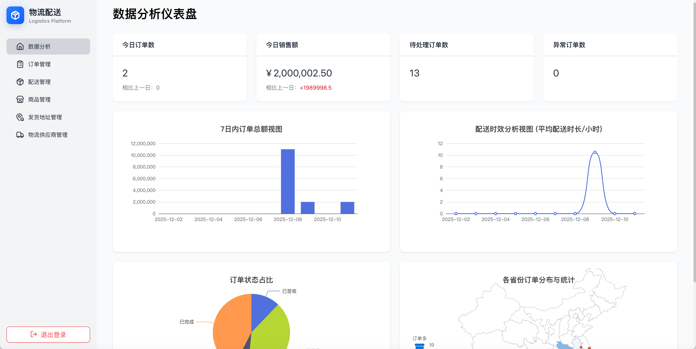
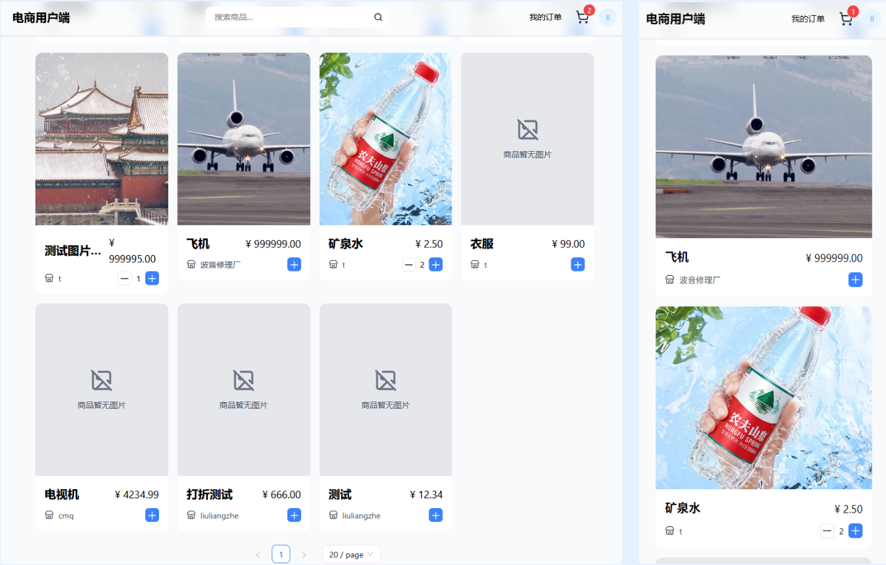
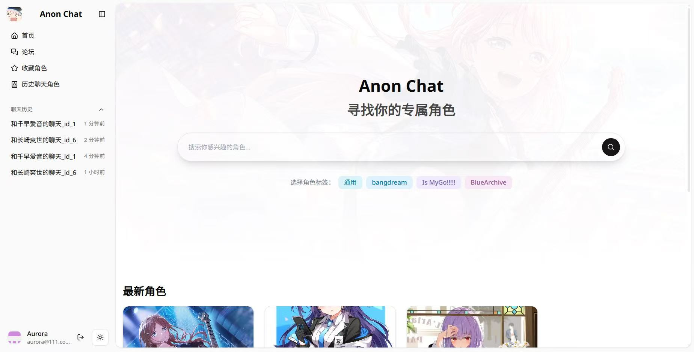
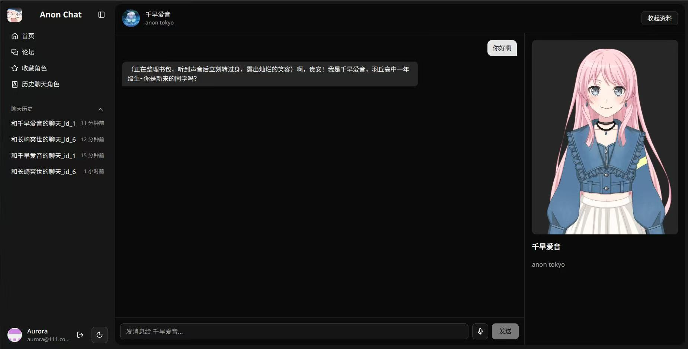
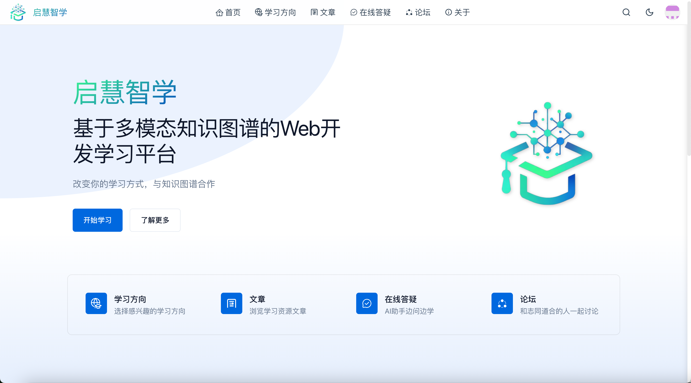

# 我参与的项目

:::timeline

:::project{date="2025.11" title="电商物流配送可视化平台"}
参加字节工程训练营时合作开发的全栈电商物流配送可视化平台，分为商家端和用户端。实现 商家备货->用户下单->商家确认并模拟发货->模拟货物运输->用户实时追踪->确认收货 的核心闭环，支持实时平滑显示模拟物流包裹位置，允许商家和用户实时跟踪。前端基于 React + TypeScript 相关技术栈；后端基于 Koa.js相关技术栈实现。

::github{repo="ELVPGroup/demo-repository"}

商家端：

用户端：

:::

:::project{date="2025.09" title="ChatAnon - 二次元角色互动聊天平台"}
一个AI角色扮演聊天应用程序，通过调用大模型能力进行角色扮演，用户可以搜索自己感兴趣的角色，并和ta交谈。前端使用 TypeScript、React、Tailwind CSS、shadcn/ui、Zustand、Live2D 相关技术实现。

::github{repo="ShirasuAzusa0/chatAnon"}

首页装饰background图像来源 [Bestdori](https://bestdori.com/info/cards/2151/Anon-Chihaya-Morning-Yawn-Time)；支持夜间模式

:::
:::progress{date="25.09.22"}
项目开始开发
:::
:::progress{date="25.09.28"}
初步完成开发
:::
:::progress{date="25.12.19"}
后端重构
:::
:::progress{date="25.12.24"}
完善live2d体验，接入语音识别
:::

:::project{date="2025.01" title="多模态知识图谱Web开发学习平台"}
基于 Nuxt.js 框架开发的知识图谱学习平台，整合文章、视频等多模态学习资源，提供用户注册、论坛互动、知识图谱可视化学习等功能，帮助用户提升学习的系统性和交互性。

::github{repo="Aurora-N/qihui-smart-learn-front"}

:::
:::progress{date="25.01.22"}
项目完成设计稿，开始开发
:::
:::progress{date="25.03.27"}
LOGO诞生
:::
:::progress{date="25.04.03"}
初步完成开发
:::
:::progress{date="25.06.15"}
参赛并获得2025年广东省大学生计算机创新作品赛二等奖
:::
:::progress{date="26.04.02"}
项目TypeScript化，优化使用体验
:::
